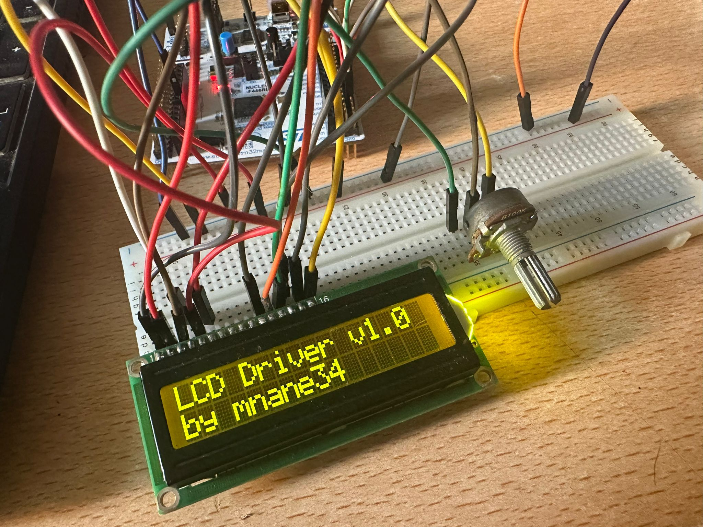

# Driver Development of 16x2 Liquid Crystal Display on STM32 

# ⚡ What is Liquid Crystal Display?

A Liquid Crystal Display (LCD) is an electronic visual display that uses the light-modulating properties of liquid crystals combined with polarizers to produce images. It is widely used in devices like monitors, calculators, and embedded systems for clear and energy-efficient visual output.

# 🔥 How to Use an LCD with Microcontrollers?

Using an LCD with a microcontroller involves connecting the display’s data and control pins to the microcontroller’s GPIO pins, then programming the microcontroller to send commands and data to the LCD. 

Typically, you initialize the LCD in your code, configure it for the desired display mode (such as 16x2 characters), and then write text or custom characters to the screen. This process allows the microcontroller to visually present information, making debugging and user interaction easier.

# 🛠️ Electrical Diagram

- **VSS (Pin 1)** 
Ground connection (GND). It serves as the reference voltage for the circuit.

- **VDD (Pin 2)**  
Power supply pin, typically connected to +5V.

- **VO (Pin 3)** 
Contrast adjustment pin. Usually connected to the wiper of a potentiometer. 
The other ends of the potentiometer connect to +5V and GND. 
This pin allows you to adjust the display contrast for optimal visibility.

- **RS - Register Select (Pin 4)**  
Determines the type of data sent to the LCD. 
RS = 0: Instruction/command register 
RS = 1: Data register

- **RW - Read/Write (Pin 5)**  
Selects the read or write mode. 
RW = 0: Write mode 
RW = 1: Read mode 
In most applications, RW is tied to GND for write-only operation.

- **E - Enable (Pin 6)**  
Enables data read/write operations. 
A high-to-low transition on this pin triggers the LCD to latch data from the data pins.

- **D0 - D7 (Pins 7 to 14)**  
8-bit data bus lines used to send commands and data to the LCD. 
Usually, 4-bit mode is used to save pins, utilizing only D4 to D7.

- **A - LED Anode (Pin 15)**  
Positive terminal for the LCD’s backlight LED, typically connected to +5V.

- **K - LED Cathode (Pin 16)**  
Negative terminal for the LCD’s backlight LED, typically connected to GND.

In this application, the STM32 Nucleo F446RE development board was used. You can refer to the above wiring diagram.

# 🚀 Code Explanation

<pre><code class="language-c">void LCD_init(GPIO_TypeDef* D4_GPIO, uint16_t D4_PIN,
              GPIO_TypeDef* D5_GPIO, uint16_t D5_PIN,
              GPIO_TypeDef* D6_GPIO, uint16_t D6_PIN,
              GPIO_TypeDef* D7_GPIO, uint16_t D7_PIN,
              GPIO_TypeDef* EN_GPIO, uint16_t EN_PIN,
              GPIO_TypeDef* RS_GPIO, uint16_t RS_PIN);
</code></pre>

This function configures the required pins for a 16x2 LCD to work with the STM32 and initializes the LCD in 4-bit mode according to its datasheet.

<pre><code class="language-c">void LCD_clear();
</code></pre>

This function sends the necessary commands to clear all characters from the LCD screen.

<pre><code class="language-c">void LCD_setCursor(unsigned char row, unsigned char column);
</code></pre>

This function positions the LCD cursor to the specified row and column based on the LCD datasheet

<pre><code class="language-c">void LCD_writeString(char *str);
void LCD_writeChar(char data);
</code></pre>

These functions handle displaying text on the LCD. LCD_writeString() sends a full string character-by-character, while LCD_writeChar() sends each individual character by splitting it into high and low 4-bit parts and transmitting them with proper control signals.

<pre><code class="language-c">void LCD_shiftRight();
void LCD_shiftLeft();
</code></pre>

These functions allow shifting the entire LCD display content horizontally; LCD_shiftLeft() moves the content to the left, while LCD_shiftRight() moves it to the right by sending the appropriate control commands to the LCD.

# 🖥️ Test Highlights

You can easily test the LCD using the following code snippet

<pre><code class="language-c">#include "main.h"
#include "LCD.h"

int main(void){

   HAL_Init();
   SystemClock_Config();
   MX_GPIO_Init();
   LCD_init(GPIOB, GPIO_PIN_15,
		           GPIOB, GPIO_PIN_1,
			       GPIOB, GPIO_PIN_2,
			       GPIOB, GPIO_PIN_12,
			       GPIOB, GPIO_PIN_14,
			       GPIOB, GPIO_PIN_13);
  LCD_clear();
  LCD_setCursor(1, 1);
  LCD_writeString("LCD Driver v1.0");
  DELAY_MS(1);
  LCD_setCursor(2, 1);
  LCD_writeString("by mnane34");

  while(1);
}
</code></pre>

## 🎉 Thank You for Reviewing!

Thank you for taking the time to check out this project.

Feel free to follow me on these platforms for more updates and projects.

- YouTube: @mnane34

- LinkedIn: Mertcan Nane